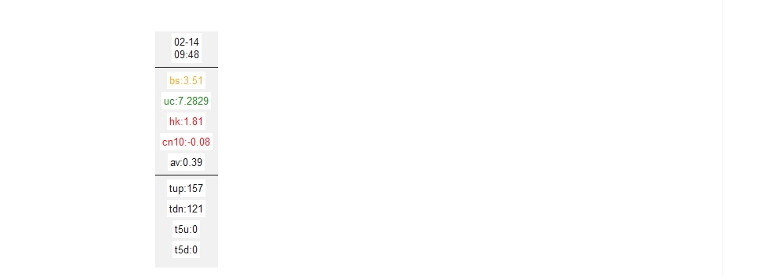

### EYUπ-feature

这些代码用 python 直接实时获取一些炒股指标，来自 b 站 up 主鳄鱼派

### 依赖

tkinter、requests

### 展示

将弹出一个可移动的悬浮窗，右键悬浮窗可关闭


### 说明

#### 含义说明

| 缩写 | 含义                |
| ---- | ------------------- |
| bs   | 基差                |
| uc   | 美元人民币          |
| hk   | 恒生科技指数        |
| av   | 全 A 成交量         |
| cn10 | 十年期国债 etf      |
| tup  | 总涨（沪深 300）    |
| tdn  | 总跌（沪深 300）    |
| t5u  | 超 5%涨（沪深 300） |
| t5d  | 超 5%跌（沪深 300） |

#### 颜色说明

| 缩写 | 含义           | 区间         | 颜色             |
| ---- | -------------- | ------------ | ---------------- |
| bs   | 基差           | (-5,5)       | 红色、橙色、绿色 |
| uc   | 美元人民币     | (7,7.1)      | 红色、橙色、绿色 |
| hk   | 恒生科技 etf   | (-1.5,1)     | 绿色、橙色、红色 |
| av   | 全 A 成交量    | (1,2)        | 黑色、黑色、黑色 |
| cn10 | 十年期国债 etf | (-0.01,0.01) | 红色、橙色、绿色 |

#### 其它

使用时注意显示的时间，如果不是实时时间，可能是卡住了，需要重启
英文缩写主要是考虑到上班摸鱼时伪装下，比较随意，见谅

#### 开发者

- 打包

```
python -m venv myenv

myenv\Scripts\activate

pip install pyinstaller

pip install  requests

pyinstaller --onefile --windowed tk.py
```
